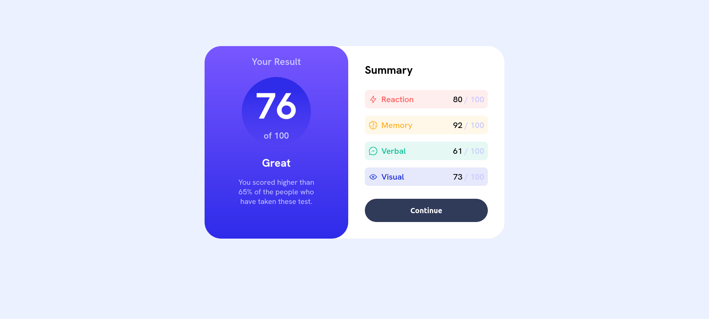
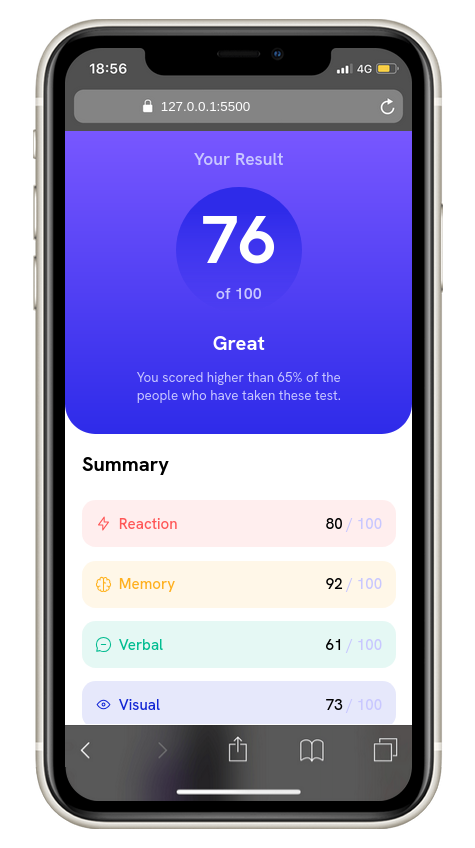

# Frontend Mentor - Social links profile

This is a solution to the [Recipe page challenge on Frontend Mentor](https://www.frontendmentor.io/challenges/recipe-page-KiTsR8QQKm). Frontend Mentor challenges help you improve your coding skills by building realistic projects.

## Table of contents

- [Overview](#overview)
  - [Screenshot](#screenshot)
  - [Links](#links)
- [My process](#my-process)
  - [Built with](#built-with)
  - [What I learned](#what-i-learned)
- [Author](#author)

## Overview

### Screenshot

### Links

- [Solution URL](https://github.com/lutfiismail52/results-summary-component/)
- [Live Site URL](https://lutfiismail52.github.io/results-summary-component/)

## My process

### Built with

- Semantic HTML5 markup
- CSS custom properties
- Mobile-first workflow

### What I learned

1. Use of the `<figure>` and `<figcaption>` tags to represent an important value/image/number.
2. Use of the `<article>` tag to wrap a standalone content, meaning it has nothing to do with other parts, such as in this project in the summary data section.
3. Use of the **CSS** `display: flexbox;` property to set the behavior of elements to be responsive according to our wishes when the element is at a certain width.
4. I need to learn JavaScript to be able to display data dynamically, such as displaying data from `data.json`

## Author

- Frontend Mentor - [@lutfiismail52](https://www.frontendmentor.io/profile/lutfiismail52)
- YouTube - [@kodedusk](https://www.youtube.com/@kodedusk)
- Instagram - [@lutfiismail47](https://www.instagram.com/lutfiismail47)
- Medium - [@lutfiismail47](https://medium.com/@lutfiismail47)